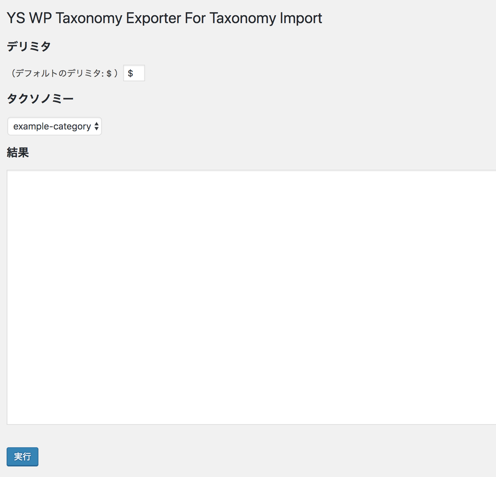
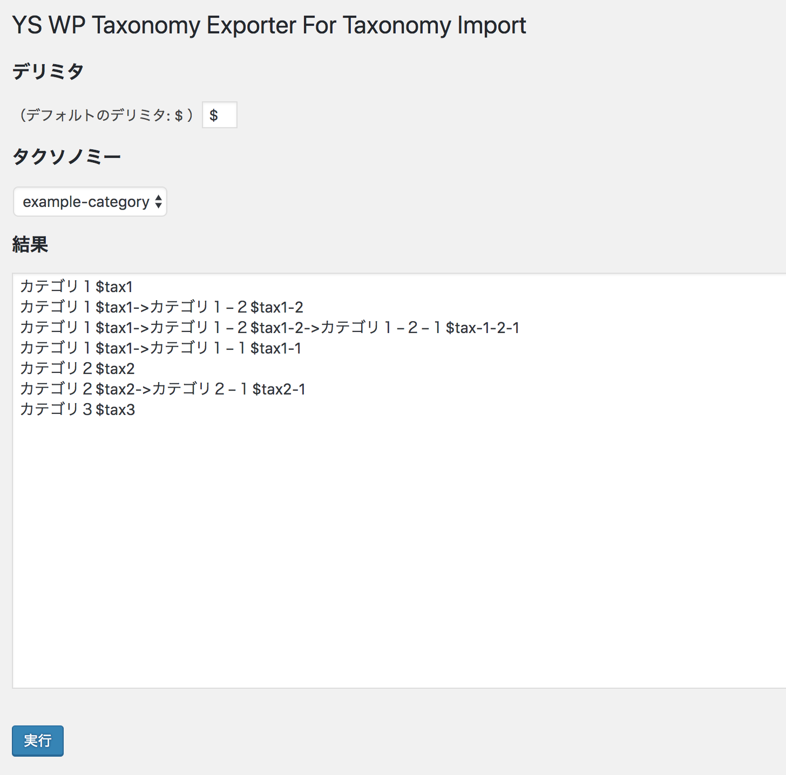
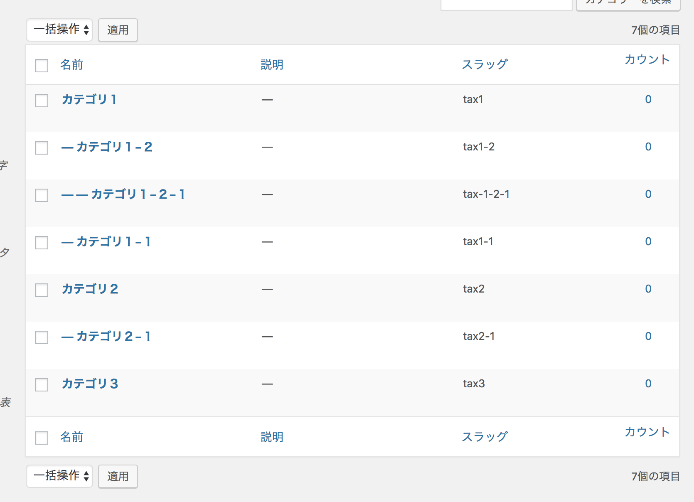

# YS WP Taxonomy Exporter For WP Taxonomy Import

WP Taxonomy Importでタクソノミーをインポートするための情報をエクスポートするプラグイン

## 使い方

### 1. プラグインのインストール・有効化

ZIPファイルをアップロード・有効化してください

### 2. エクスポートの実行

「設定」→「YS WP Taxonomy Exporter For Taxonomy Import」ページを開きます。

エクスポートするタクソノミーを選択して「実行」ボタンをクリックします。

### 3. WP Taxonomy Importにコピペ

結果をコピーし、WP Taxonomy Importのインポート実行画面に貼り付けます。

タクソノミーの階層構造も再現されます。
